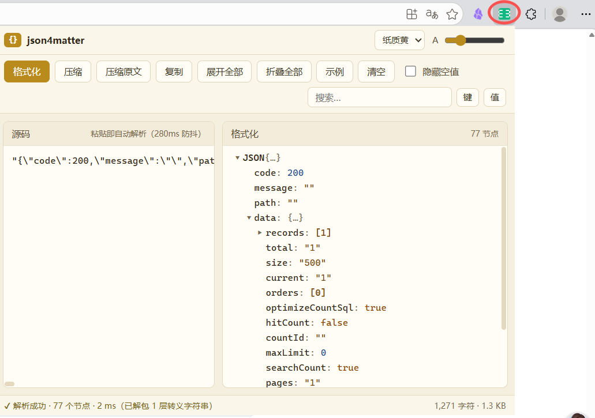

# json4matter

Windows 桌面 JSON 格式化查看器 — WPF + .NET 8，单文件 exe，启动 < 1 秒

## 下载

**[⬇ 下载 json4matter\_0.0.1.exe](https://github.com/Memorry0/json4matter/raw/main/json4matter_0.0.1.exe)**（约 300KB）

- Windows 10/11 x64，绿色单文件、免安装、双击即用
- 需已安装 [.NET 8 Desktop Runtime](https://dotnet.microsoft.com/download/dotnet/8.0)（仅首次）
- 完整功能清单见 [FEATURES.md](FEATURES.md)

## 浏览器扩展版（新）

同一套 JSON 格式化能力的浏览器版本（Chrome / Edge，MV3，免安装打包、零依赖）：  
**专门用来对付接口日志里被序列化的 JSON 字符串** —— 复制出来贴进去，自动剥掉转义、树形着色查看。  
支持弹窗与侧边栏两种打开方式，以及页面右键「用 json4matter 格式化选中内容」。

详见 [browser-extension/README.md](browser-extension/README.md)。

## 界面预览




## 功能

完整清单见 [FEATURES.md](FEATURES.md)。速览：

- **左右双栏**：粘贴自动解析，右侧树形视图；数组折叠标数、大文档虚拟化渲染不卡顿
- **单击定位**：点左栏任意 key/value，右树滚动定位、整棵子树高亮（大文件深处也能定位）
- **修改标红**：以首次格式化为基线 — 改值只红值、改 key 红 key 加粗、改回自动恢复；修改后保持展开并定位
- **搜索**：键搜索 / 值搜索，命中黄色高亮 + 计数 + 滚动定位，Enter 重复、Esc 清除
- **转义 JSON**：整段转义字符串自动解包（≤5 层）；字段值内嵌转义 JSON 可展开为结构化子树
- **多媒体预览**（可选开关）：URL 是图片/PDF/视频时悬浮预览、点击弹卡片查看大图/首页渲染/播放，可下载
- **隐藏null值和空数组**、两种压缩（转 Unicode / 保留中文）、复制 Toast、右键复制节点
- **三主题**（清新绿/纸质黄/清爽白）、字号 11–20、默认全屏，设置持久化

## 构建

需要 [.NET 8 SDK](https://dotnet.microsoft.com/download/dotnet/8.0)（仅支持 Windows）。

```bash
# 运行
dotnet run -c Release

# 发布单文件 exe（约 1MB，框架依赖）
dotnet publish -c Release -r win-x64 --self-contained false -p:PublishSingleFile=true -p:PublishReadyToRun=false

# 自包含单文件（目标机器免装运行时，约 60MB）
dotnet publish -c Release -r win-x64 --self-contained true -p:PublishSingleFile=true
```

## 项目结构

```
json4matter/
├── json4matter_0.0.1.exe  # 预编译版（直接下载即用）
├── App.xaml(.cs)          # 应用入口、主题资源、全局异常日志
├── MainWindow.xaml(.cs)   # 主窗口：布局、解析、定位、diff、搜索、压缩
├── SettingsWindow.xaml    # 设置窗口（主题/字号/全屏/多媒体）
├── Themes/                # 三套主题资源字典（Token 化配色）
├── ThemeManager.cs        # 主题切换（chrome 字典 + 树 VM 配色）
├── JsonNodeVM.cs          # 树节点视图模型（标数/diff/搜索高亮/内嵌JSON）
├── JsonPathLocator.cs     # 源码光标 → JSON 路径的词法扫描器
├── Media/                 # 多媒体预览（URL识别/卡片/插件下载/解码器）
└── Settings.cs            # 设置持久化
```

## 设计

界面遵循克制用色的产品设计规范（见 PRODUCT.md / DESIGN.md）：中性色骨架 + 单一强调色（≤10%），key 近黑（≥4.5:1 对比度），值按类型着色（字符串绿/数字蓝/布尔橙/null 灰斜体），修改标红同时加粗。面板无阴影（1px 边框 + 圆角），按钮全界面同一形状词汇，设置窗口为 iOS 风格开关与主题色卡。

## License

MIT
